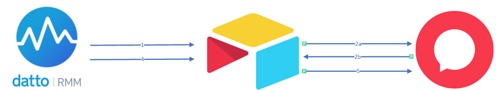

# Halo to Datto Ticket Sync

## Introduction

Our MSP recently migrated from Autotask PSA to Halo PSA. One of the big fallouts for me Autotasks tight integration with Datto, particularly around ticket sync. The Integration offered from Halo allows tickets to get created in Halo from Datto alerts but they do not close if the alert is resolved in Datto.

Even worse is to have the alert created via e-mail and have another e-mail when the alert is resolved creating a second ticket and a tonne of administration time.

This drove me crazy in wasted administration time so I wanted to create an automation that created tickets and closed them leveraging the webhook option from Datto.

Airtable offered a simple way to map the Datto alert ID to the Halo ticket as well as map any customer names that may mismatch between the systems. 

### Current Limitation

At the time of writing this is a MVP (minimum viable product) as there is some limitations with Airtable only being able to receive a maximum 5 webhooks/sec, however this hasn't yet caused me an issue as even if a site down occurs each Datto agent is polling at slightly different times so I am yet to see the this limit be exceeded, there are many option to work around this limit but would involve an extra tool/step in the chain.

### High Level Architecture

1. Datto Sends Webhook to of new alert to Airtable and a new entry is created
2. When a new row event occurs in Airtable a workflow is triggered in Pipedream which creates the new ticket in Halo
3. Pipedream updates the row in Airtable with the Ticket ID returned from the API call that created the ticket
4. Datto sends a webhook to Airtable when the alert is resolved in Datto which updates the Airtable row (status field) to reflect the closure
5. Pipedream is triggered by the airtable "row modified" event and updates the ticket status and adds a closure note to the ticket.

**Note: **Additionally there is a daily scheduled garbage collection which cleans up alerts that are closed in both platforms for more than X amount of hours. This is not strictly necessary but keeps our Airtable base clean and keeps us in a free tier 😊.

#### Shameless Plug :)

If this Automation looks like it will help you please consider using my Pipedream affiliate link to sign up for Pipedream even if you initially just want to he free tier it could be a huge help to me in the future: http://pipedream.com/?via=kris
